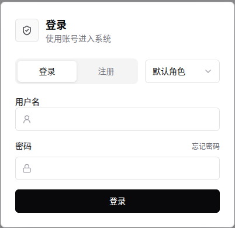
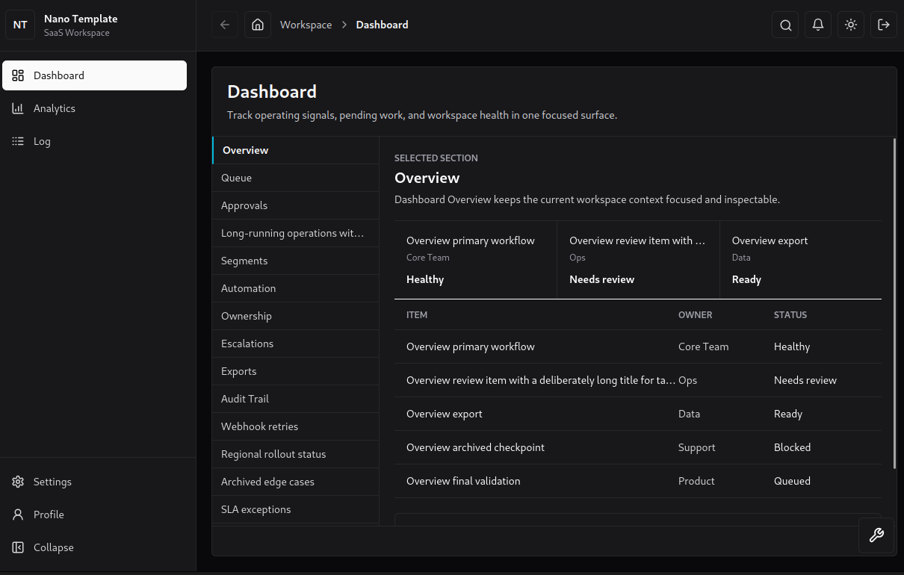
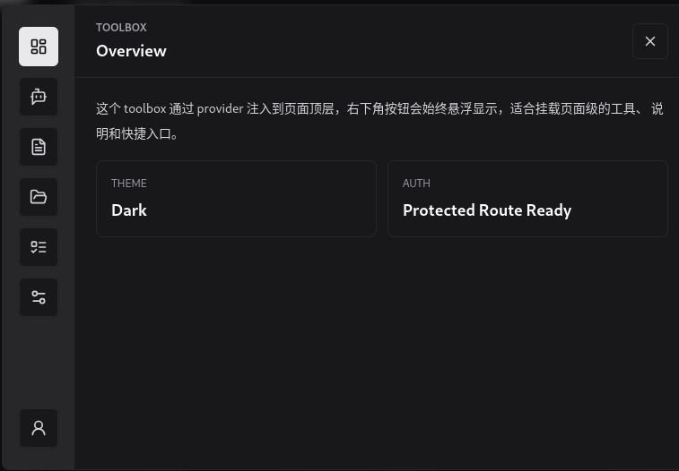

## Nano Template

### 介绍

一个架构清晰的双层 rpc 调用全栈项目, 后端使用 gin 框架编写, 前端使用 react-ts 编写. 当前基于 golang 的全栈通用模板较少, nano template 因此开发设计.

nano template 并不完整地做出一个成品 web 应用服务, 而是一个基于容器环境可简单配置快速部署的解决方案, 借助 ai 能力仿照当前已有的设计快速做出 demo 原型并进行部署验证.

nano template 将系统的拓展性交给使用者, 代码简单易懂, 能够快速上手使用. nano template 并不采用任何生产环境验证架构设计, 主要为轻量和自主控制设计.

### 如何使用?

```bash
git clone --depth=1 git@github.com:wensboy/nano_template.git
cd nano_template
# 完善必要的配置(.env, env.yaml, Dockerfile, docker-compose.yaml)后
docker compose up -d
```

### 运行效果

**登录/注册**



**简单 Saas 设计**



**顶层 toolbox**



### 参考
- [后端参考](./backend/readme.md)
- [前端参考](./frontend/readme.md)

